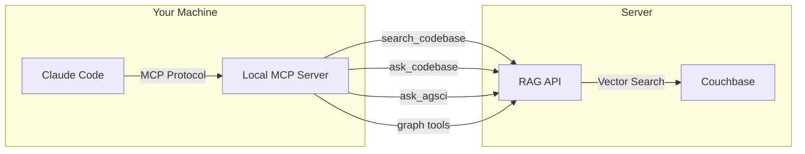

# CodeSmriti RAG MCP Server

MCP server that connects Claude Code (and other MCP clients) to the CodeSmriti RAG API.

## Architecture


```mermaid
graph LR
    A[Claude Code] -- MCP Protocol --> B[Local MCP Server]
    B -- search_codebase --> C[RAG API]
    B -- ask_codebase --> C
    B -- ask_agsci --> C
    B -- graph tools --> C
    C -- Vector Search --> D[Couchbase]

    subgraph "Your Machine"
        A
        B
    end

    subgraph "Server"
        C
        D
    end
```

## Tools

| Tool | Purpose |
|------|---------|
| `list_repos` | Discover indexed repositories |
| `explore_structure` | Navigate directory structure of a repo |
| `search_codebase` | Semantic search at symbol/file/module/repo/doc/spec level |
| `get_file` | Retrieve source code from indexed repos |
| `ask_codebase` | RAG-powered answers about code with citations |
| `ask_agsci` | Business-facing answers from BDR briefs |
| `affected_tests` | Find tests impacted by changed files (via dependency graph) |
| `get_module_criticality` | PageRank-based module importance scoring |
| `get_graph_info` | Dependency graph summary |

## Setup

### 1. Create the virtual environment

```bash
cd services/mcp-server
uv venv .venv
uv pip install -r requirements.txt --python .venv/bin/python
```

### 2. Configure credentials

Create `services/mcp-server/.env`:

```env
CODESMRITI_API_URL=https://smriti.agsci.com
CODESMRITI_USERNAME=your-email
CODESMRITI_PASSWORD=your-password
```

### 3. Configure Claude Code

The project `.mcp.json` (already in repo root) registers the server:

```json
{
  "mcpServers": {
    "codesmriti": {
      "command": "/path/to/code-smriti/services/mcp-server/.venv/bin/python",
      "args": ["services/mcp-server/rag_mcp_server.py"]
    }
  }
}
```

Then enable it in `.claude/settings.local.json`:

```json
{
  "enabledMcpjsonServers": ["codesmriti"]
}
```

### 4. Verify

In Claude Code, run `/mcp` to check connection status.

## Troubleshooting

**"Failed to reconnect"** — test the server manually:

```bash
cd /path/to/code-smriti
services/mcp-server/.venv/bin/python services/mcp-server/rag_mcp_server.py
```

Common issues:
- **`ModuleNotFoundError`**: Reinstall deps with `uv pip install -r requirements.txt --python .venv/bin/python`
- **Segfault**: Stale venv after OS/Python upgrade. Recreate with `uv venv .venv` then reinstall deps.
- **Auth failure**: Check credentials in `services/mcp-server/.env`
