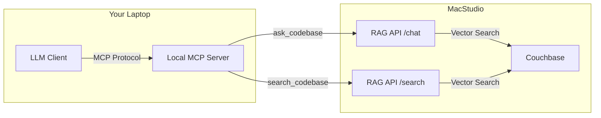

# CodeSmriti RAG MCP Server

This directory contains a Model Context Protocol (MCP) server that bridges your local LLM tools (Claude Desktop, VSCode, etc.) with the deployed RAG API.

## Architecture

## Architecture


- **LLM Client**: VSCode (with Cline/MCP extension), Claude Desktop, or Gemini CLI.
- **Local MCP Server**: `rag_mcp_server.py`. Exposes two tools:
  - `search_codebase`: Returns raw code chunks. Useful when you want the LLM to analyze code directly.
  - `ask_codebase`: Returns a RAG-generated answer with citations. Useful for high-level questions.
- **RAG API**: The service running at `https://macstudio.local/api`.

## Setup

1. Ensure you have Python installed (preferably with `uv` for easy execution).
2. Install dependencies:
   ```bash
   pip install -r requirements.txt
   ```

## Usage

### 1. Claude Desktop App

Add this to your `~/Library/Application Support/Claude/claude_desktop_config.json`:

```json
{
  "mcpServers": {
    "code-smriti": {
      "command": "uv",
      "args": [
        "run",
        "--with",
        "mcp",
        "--with",
        "httpx",
        "/Users/kaustubh/Documents/code-smriti/4-consume/mcp-server/rag_mcp_server.py"
      ]
    }
  }
}
```
*(Note: Adjust the path if needed. Using `uv run` is recommended to handle dependencies automatically.)*

### 2. VSCode (via Cline or MCP Extension)

If using **Cline**:
1. Open Cline settings.
2. Add a new MCP server.
3. Command: `uv`
4. Args: `run --with mcp --with httpx /Users/kaustubh/Documents/code-smriti/4-consume/mcp-server/rag_mcp_server.py`

### 3. Testing Locally

You can test the server using the MCP inspector or by running it directly (it uses stdio by default).

To test the API connection directly without MCP:
```bash
curl -k -X POST http://macstudio.local/api/chat/test \
  -H "Content-Type: application/json" \
  -d '{"query": "What is the architecture of this project?", "stream": false}'
```
